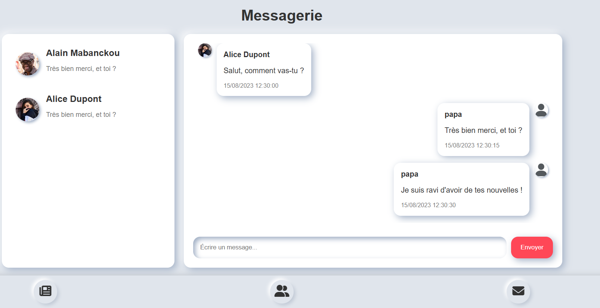

# Mini Réseau Social - Test Technique pour AZUR TECH RESEARCH

Ce projet est un mini réseau social développé dans le cadre d'un test technique pour AZUR TECH RESEARCH. 

L'application comprend une page de fil d'actualité, une page de messagerie, une page de liste d'amis et une page de profil utilisateur, toutes conçues dans un style Neumorphisme.

## Table des matières

1. Technologies utilisées
2. Structure du projet
3. Fonctionnalités
4. Installation et exécution
5. Organisation du développement
6. Démonstration et publication
7. Auteur

## Technologies utilisées

* **HTML, CSS, JavaScript pur** : pour le développement de l'interface sans frameworks
* **Neumorphisme** : pour le style de l'interface utilisateur
* **GitHub Pages** : pour l'hébergement de l'application
* **GitHub Kanban** : pour la gestion de projet

## Structure du projet

Les fichiers sont organisés de manière à respecter une structure claire, facilitant la lisibilité du code et l'organisation des classes CSS sans framework :

* **index.html** : fichier principal de l'application
* **/assets** : contient les images (ex. : photos de profil pour les utilisateurs)
* **/data** : contient les fichiers JSON utilisés pour simuler les données (posts, conversations)
* **/css** : fichier CSS pour la mise en forme de l'interface en Neumorphisme
* **/js** : code JavaScript gérant la logique de l'application (interactions DOM, gestion des événements)

## Fonctionnalités

### Page de feed

* **Affichage des posts** (texte ou photo) à partir d'un fichier JSON. Les posts sont uniformes en termes de structure JSON
* **Réactions aux posts** (Like, Dislike, Love) avec animation de particules.
* **Commentaire sur les posts** et **affichage des images en plein écran** lorsqu'elles sont présentes dans un post.


### Page de messagerie

* **Liste des conversations** chargée dynamiquement via le DOM à partir d'un JSON
* Affichage du **dernier message** de chaque conversation et historique des messages d'une conversation donnée
* **Ajout de nouveaux messages** avec horodatage et gestion de l'affichage des informations de l'expéditeur (nom, photo de profil, contenu du message)



### Page de liste d'amis

* Affichage d'une **liste d'amis codée en dur**
* **Filtrage par nom et prénom**
* **Drag-and-drop** pour réorganiser la liste d'amis
* **Lien vers la messagerie** pour accéder aux conversations avec chaque ami
* **Lien vers la page profil** pour accéder à des informations détaillées sur l'utilisateur


## Installation et exécution

1. **Cloner le projet** :

```bash
git clone https://github.com/cheikh-mbacke/coucoon.git
```

2. **Sur VS Code, Ouvrez le fichier** `index.html` avec *Live Server* pour voir le projet en local

## Organisation du développement

* **Documentation** : [Le cahier des charges](https://github.com/cheikh-mbacke/coucoon/tree/main/assets/ressoucres/Cahier-des-charges.pdf), [les spécifications fonctionnelles](https://github.com/cheikh-mbacke/coucoon/tree/main/assets/ressoucres/specs-fonctionnelles.pdf) et [les user stories](https://github.com/cheikh-mbacke/coucoon/issues?q=is%3Aissue) sont disponibles dans l'onglet issues.
* **Gestion des tickets** : L'organisation des tickets a été réalisée via un [tableau Kanban sur GitHub](https://github.com/users/cheikh-mbacke/projects/2).

## Démonstration

Le projet est publié et peut être consulté en ligne via GitHub Pages à l'adresse suivante : https://cheikh-mbacke.github.io/coucoon/


## Développé Par :

Cheikh MBACKE

**E-mail :** mbackecheikhouna7@gmail.com

**Linkedin :** https://www.linkedin.com/in/mbcheikh/
